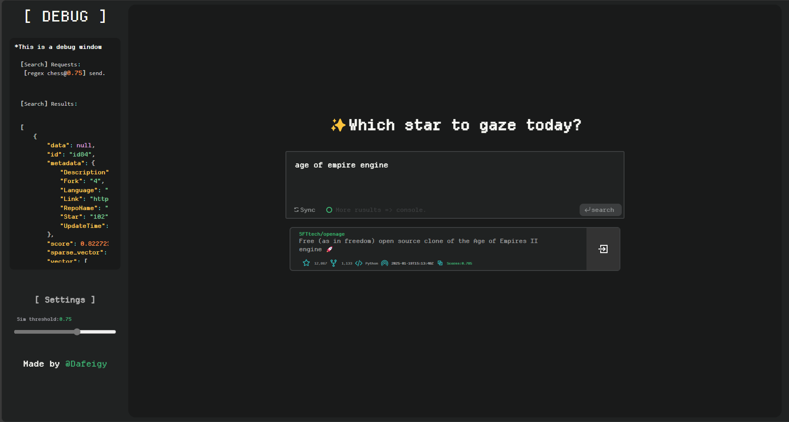

## What is this:

Help you search the specific repo among your(Currently my) starred repos.

It will be reconstruct in FastAPI + Vue3.




## Tech

Vercel + Flask + Ajax 

## Thanks

- @Fusion-Pixel

- @Vercel

- @Cline + Deepseekv2.5

## How to fetch users' stars info with high effiency?

Github RESTAPI provides an [endpoint](https://docs.github.com/en/rest/activity/starring?apiVersion=2022-11-28#list-repositories-starred-by-a-user) to get user's starred repo info(BTW it hides very deep).
This endpoint supports [pagination](https://docs.github.com/en/rest/using-the-rest-api/using-pagination-in-the-rest-api?apiVersion=2022-11-28),
which means async methods maybe useful.

To do so, however, requires both sync/async methods. Here are the steps:
1. Based on `GITHUB_USER`, to get `user_id`(number) and total `stars_num`;
2. Set `per_page=100` and based on total `stars_num` calculate the `page_num`.
3. Generate all urls. Example:
   ```python
   #Assume userid=123456, total stars repo = 2345
   #page_num is therefore 2345//100 + [0,1] = 24
   #[0,1] is based on whether 2345%100==0
   #Here is an example:
    urls = [
        f"https://api.github.com/user/123456/starred?per_page=100&page={i}"
        for i in range(1, 25)
    ]
    ```
    until this part, all should be done sync.
4. @Async fetch urls. It works fine.